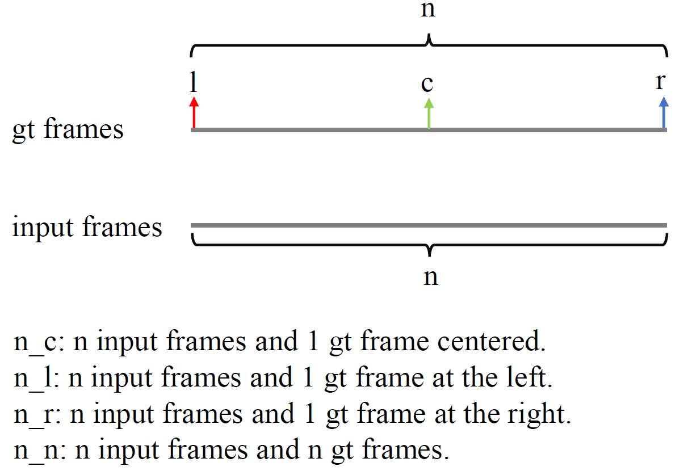

# Dataset
# Parameters
```
name: The dataset name DVD, GoPro and REDS

mode: construct the dataset for train or val

sampling: the sampling mode for generating pairs of input frames and gt frames. 

overlapping: Where sampling consecutive frames, whether overlapped. True or False.

interval: The interval of sampled consecutive frames. 

root_gt: The ground truth root path.

data_type: "imgs"

num_frames: The number of frames are sampled.

augmentation: Augmentaions for input frames. 

loader: The configs for construct the dataloader. 
```
## Detail Description
**sampling**: The sample mode  generating the input frames and gt frames. "n_c", "n_n", "n_r", "n_l" are the general options implemented in SimDeblur. Taking "n_c" for an example, 'n' before '\_' stands for n input frames assigned by "num_frames". 'c', 'n', 'r' after '\_' means the relative position relationship between input frames and gt frames. Specifically, 'r' is right, 'c' is center, 'l' is left and 'n' is n frames. The following picture depicts it clearly. 



**augmentation**: The image augmentation for training. At now, it includes RandomCrop, RandomHorizontalFlip, RandomVerticalFlip,RandomRotation90, RandomReverse. Each of them has a Randomness controlled by a probability p (default is 0.5). 

**num_frames**: The number of input frames. Many video deblurring frameworks take 5 blurry frames as input, and single image deblurring alorithms take 1 blurry image for input. 